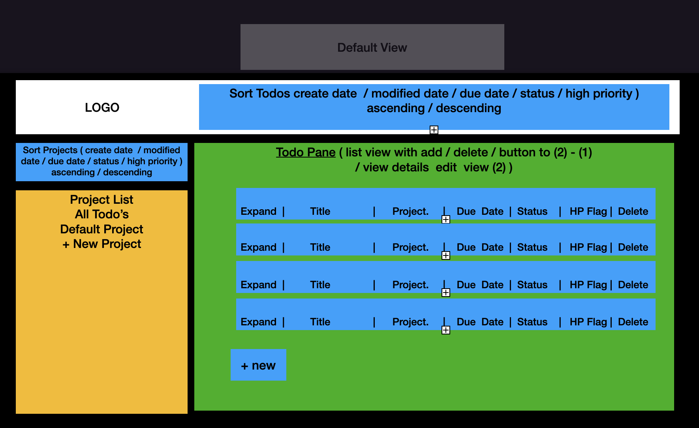
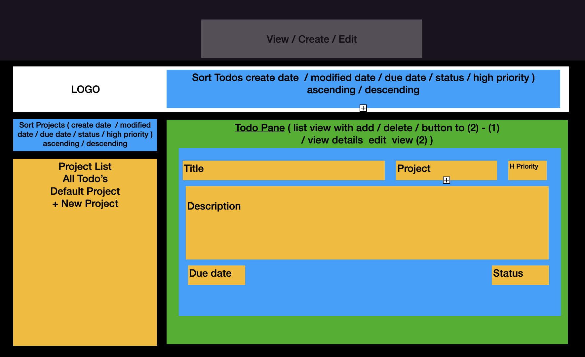

# todo_project

 Simple todo app using local storage   -- UPDATE: see note at bottom.

## Project Requirements

<https://www.theodinproject.com/lessons/node-path-javascript-todo-list>

### My Initial Planning Thoughts

- Nothing crazy fancy, UI or in functionality. Going to make an MVP.
- Keep working towards goal of modular, reusuable code that for the most part is SOLID - with the main focus on Single Responsibility (S) and Loose Coupling (D)
- ~~Implement a pub/sub architecture design / design pattern in this project~~ MVC instead
- Build with Webpack
- First time working with local storage - review docs
- Review modal examples -- apply to project

#### Properties to include in the main 'ToDo object'

- record key/hash (UUID Library)
- title
- description
- due date (using date libary)
- due status (upcoming, today, overdue)
- priority flag (normal / high) (boolean)
- todo completion status (boolean)
- project todo belongs to (defaults to default project)
- the soonest todo due date for
- creation date / time (for sort using date library)
- last modified date / time (for sort using date library)
  
#### Required Views

- view all projects
- view all todos in each project (Project Title, todo title and duedate with a color applied for high priority)
- expand a todo to see and edit details
- delete todo
- delete project (not actually in requirements but not having that is wonky) assigned todo's for deleted project go back to default project or give option to delete all???

#### localStorage tips

- make function that checks localstorage for data when app is first loaded
- make function that saves / updates when todo's or projects are edited
- handle there not being any localstorage data to prevent crash
- its JSON, so don't try to store methods?? check assumptions on this... 

#### UI Mockups

- Default View (list view)

- View Details / Create New / Edit
  

#### Main Modules

- container
- project sort
- todo sort
- logo pane
- todo sort pane
- project pane
- todo pane
- localStorage write
- localStorage read
- pub/sub controller

## NOTE: (2/9/23)
The information above was written out two months ago, and I've decided to pare down my aspirations for this project. I will keep it for reference, but I am not commiting myself to implementing every aspect.